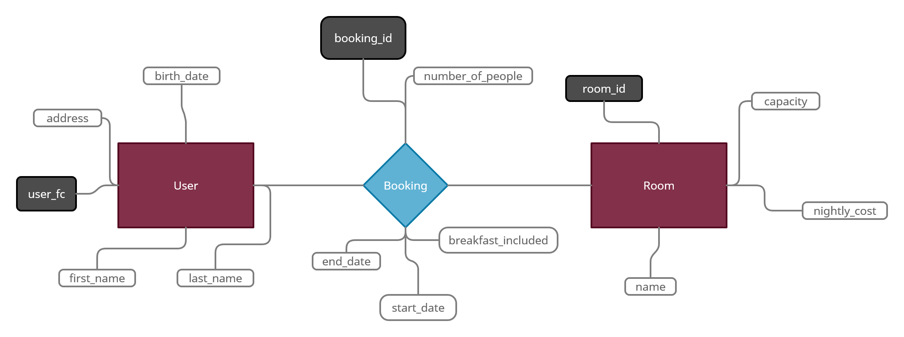

# B&B

È stata richiesta la realizzazione di un sito web per la gestione di un bed & breakfast.
Il sito sarà utilizzabile da un addetto del personale a diretto contatto con il cliente.

Si potrà prenotare una stanza specificando:
 - la stanza
 - i dati anagrafici del cliente
 - il numero di persone che soggiorneranno
 - il periodo di soggiorno (data di inizio e di fine)
 - se la colazione è inclusa o meno

Il pagamento potrà essere effettuato in qualsiasi momento precedente alla prima notte di soggiorno fisicamente alla cassa.

È anche possibile annullare una prenotazione (ma non modificarla), versando fisicamente alla cassa una quota pari al 5% del costo del soggiorno.
In tal caso il gestore delle prenotazioni potrà rimuovere la prenotazione dal database mediante l'apposita pagina di gestione delle prenotazioni.

In caso di non comunicata assenza sarà necessario pagare una penale pari al 25% del costo del soggiorno.

## Analisi

Per la modellazione della base dati si individuano le seguenti entità:

 - **User**: rappresenta un utente che può prenotare delle stanze
   - *user_fc*: codice fiscale dell'utente, usato come chiave primaria in quanto univoco
   - *first_name*: nome dell'utente
   - *last_name*: cognome dell'utente
   - *birth_date*: data di nascita dell'utente
   - *address*: indirizzo dell'utente
 - **Room**: rappresenta una stanza che può essere prenotata da un utente
   - *room_id*: id univoco per identificare una stanza, usato come chiave primaria
   - *capacity*: numero di persone massime che possono alloggiare nella stanza
   - *cost_per_night*: costo della stanza per persona per notte
   - *name*: nome opzionale dato alla stanza

La relazione tra User e Room è di cardinalità M ad N, poiché un utente, in periodi differenti, può prenotare più stanze e ogni stanza, sempre in periodi differenti, può essere prenotata da più utenti. La relazione tra le due entità deve necessariamente contenere il periodo di prenotazione.

Si definisce quindi la relazione **Booking**, con i seguenti attributi:
    - *booking_id*: id univoco per identificare la prenotazione (chiave primaria)
    - *number_of_people*: numero effettivo di persone che alloggeranno nella stanza (non deve superare la *capacity* di essa)
    - *start_date*: data di inizio dell'alloggio (maggiore della data in cui è fatta la prenotazione)
    - *end_date*: data di fine dell'alloggio (maggiore della *start_date*)
    - *breakfast_included*: indica se la colazione è inclusa o meno (il costo aggiuntivo sarà calcolato partendo da un valore contenuto in un db chiave-valore)
    - *paid*: indica se il prezzo è stato pagato alla cassa o meno

## Modello concettuale

A partire dalla precedente analisi si realizza il seguente modello concettuale.

## Modello logico

Users(**user_fc**, first_name, last_name, birth_date, address)

Rooms(**room_id**, capacity, cost_per_night, name)

Bookings(**booking_id**, number_of_people, start_date, end_date, breakfast_included, paid, *room_id*, *user_fc*)